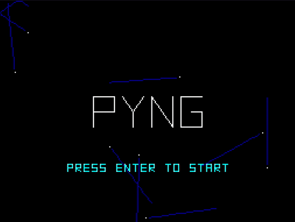
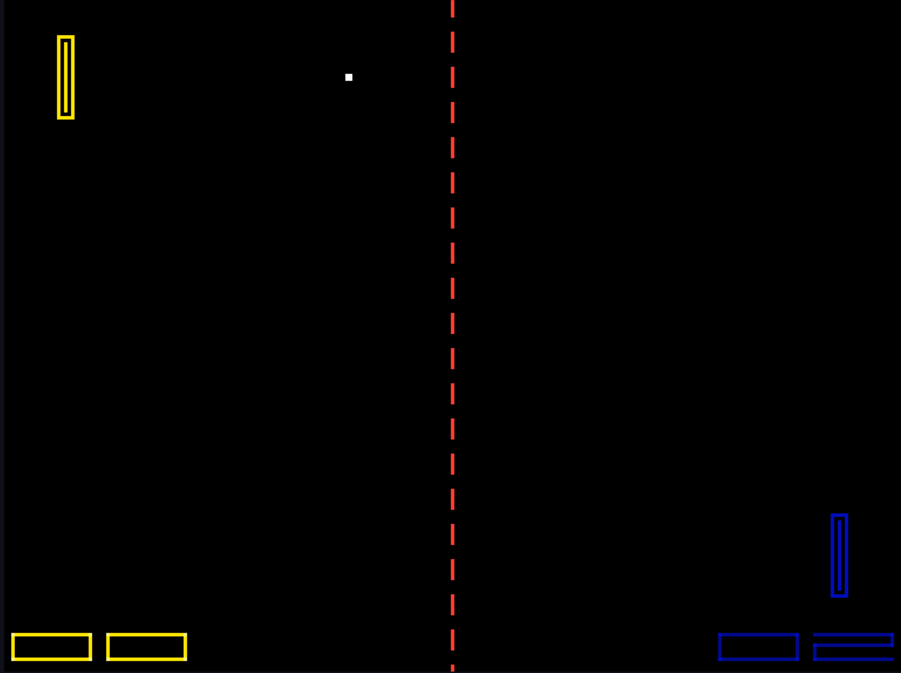
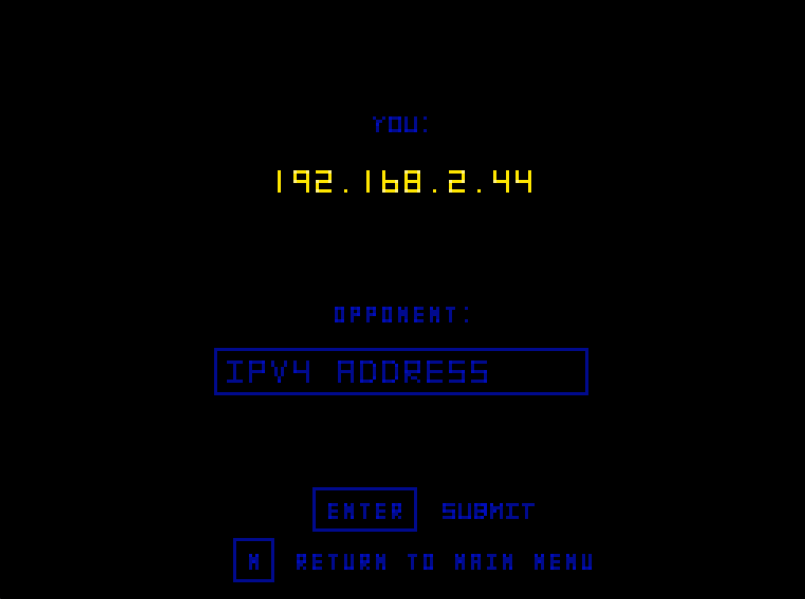

# PYNG
+ Python + LAN + Pong = PYNG
+ A vector-graphics inspired implementation of Pong. Play locally or against a friend over LAN. Built using [pyxel](https://github.com/kitao/pyxel).

### Setup
+ Clone the repo
+ Install [pyxel](https://github.com/kitao/pyxel) & dependencies
+ From project directory run `python app.py`

### LAN Match
+ Select "LAN Connect" from main menu
+ Enter your opponent's IP address displayed on the LAN connect menu
+ Pong till you drop!

